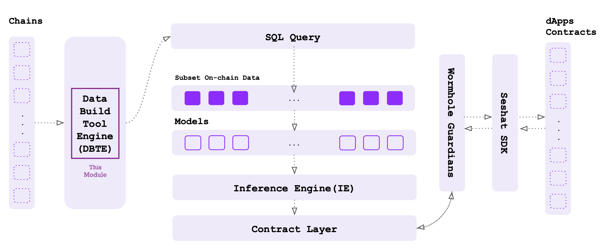

### Introduction

The transformation layer to create reusable tables/views on top of raw blockchain data ingested by [seshat-ingestor](https://github.com/seankhatiri/seshat-ingestor)

### Setup

To setup the project first you need to give executable permission to the entry.sh script:

    chmode +x entry.sh

Then by running this script file, first it will create a pipenv environment to install the required dependencies based on youe system Python version:

    source entry.sh (macos)

Note: To test your model locally, you need to have postgres db instance up on localhost (PORT=5432) with required tables your new model depends on.

### Adding a dbt model

WIP

### Resources:
- Learn more about Seshat base layer [in the docs](https://docs.seshatlabs.xyz)
